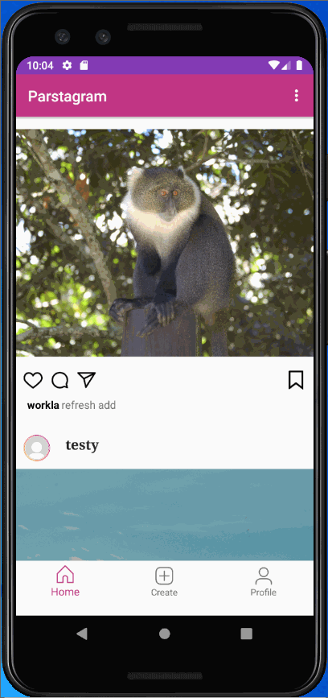

# Project 3 - *Parstagram*

**Parstagram** is a photo sharing app similar to Instagram but using Parse as its backend.

Time spent: **12** hours spent in total

## User Stories

The following **required** functionality is completed:

- [x] User can view the last 20 posts submitted to "Instagram".
- [x] The user should switch between different tabs - viewing all posts (feed view), compose (capture photos form camera) and profile tabs (posts made) using fragments and a Bottom Navigation View. (2 points)
- [x] User can pull to refresh the last 20 posts submitted to "Instagram".

The following **optional** features are implemented:

- [x] User sees app icon in home screen and styled bottom navigation view
- [x] Style the feed to look like the real Instagram feed.
- [ ] User can load more posts once he or she reaches the bottom of the feed using infinite scrolling.
- [ ] Show the username and creation time for each post.
- [ ] User can tap a post to view post details, including timestamp and caption.
- [ ] User Profiles
      - [ ] Allow the logged in user to add a profile photo
      - [ ] Display the profile photo with each post
      - [ ] Tapping on a post's username or profile photo goes to that user's profile page and shows a grid view of the user's posts 
- [ ] User can comment on a post and see all comments for each post in the post details screen.
- [ ] User can like a post and see number of likes for each post in the post details screen.

The following **additional** features are implemented:

- [ ] List anything else that you can get done to improve the app functionality!

## Video Walkthrough

Here's a walkthrough of implemented user stories:

The first gif shows the basic functionality.  It shows a new user (badname) trying to log in and not being allowed, and then the same user signing up and getting in.  The three fragments with the bottom navigation screen are present.  The home tab shows the instragram feed, and then the profile screen has no posts because badname just signed up and has never posted.  Then we log out and log back in with testy, who has posted before.  Testy sees the same instagram feed, but testy's profile shows all of the posts by testy specifically.  Testy shows off creating a post and moves to the home screen to see the newly created post present.  Testy also shows that a post will only be created with both a description and a picture.  Items in this gif:
-User can view the last 20 posts submitted to "Instagram".
-The user should switch between different tabs - viewing all posts (feed view), compose (capture photos form camera) and profile tabs (posts made) using fragments and a Bottom Navigation View. (2 points)
-User sees app icon in home screen and styled bottom navigation view
-Style the feed to look like the real Instagram feed.

The second gif shows the pull to refresh, where workla is logged in and shows the feed, but when workla pulls down, the feed refreshes, showing testy's most recent post.  Items in this gif:
-User can pull to refresh the last 20 posts submitted to "Instagram".

GIF created with [LiceCap](http://www.cockos.com/licecap/).

## Notes

Describe any challenges encountered while building the app.

It took some work to get pull to refresh to work within the fragment instead of the activity as we had done before.  I also had previously built a log out button and had to rebuild as a menu bar collapsed feature to move it out of the tab where the create post info was that was originally our only screen.  

## Open-source libraries used

- [Android Async HTTP](https://github.com/codepath/CPAsyncHttpClient) - Simple asynchronous HTTP requests with JSON parsing
- [Glide](https://github.com/bumptech/glide) - Image loading and caching library for Android

## License

    Copyright 2020 Lauren Work

    Licensed under the Apache License, Version 2.0 (the "License");
    you may not use this file except in compliance with the License.
    You may obtain a copy of the License at

        http://www.apache.org/licenses/LICENSE-2.0

    Unless required by applicable law or agreed to in writing, software
    distributed under the License is distributed on an "AS IS" BASIS,
    WITHOUT WARRANTIES OR CONDITIONS OF ANY KIND, either express or implied.
    See the License for the specific language governing permissions and
    limitations under the License.

# LAST WEEK

**Parstagram** is a photo sharing app similar to Instagram but using Parse as its backend.

Time spent: 11 hours spent in total

## User Stories

The following **required** functionality is completed:

- [x] User can sign up to create a new account using Parse authentication.
- [x] User can log in and log out of his or her account.
- [x] The current signed in user is persisted across app restarts.
- [x] User can take a photo, add a caption, and post it to "Instagram".

The following **optional** features are implemented:

- [x] User sees app icon in home screen and styled bottom navigation view
- [x] Style the feed to look like the real Instagram feed.
- [ ] After the user submits a new post, show an indeterminate progress bar while the post is being uploaded to Parse.

The following **additional** features are implemented:

- [ ] List anything else that you can get done to improve the app functionality!

## Video Walkthrough

Here's a walkthrough of implemented user stories:

The first gif shows the basic functionality.  First a nonexistent user tries to log in and it doesn't work.  Then a known user logs in and it works.  Then a sample post is shown being created.  Then the app is shown not allowing a post missing either a description or picture.  Fianlly, the current user logs out, which takes them back to the login activity.

The second gif shows teh creation of a user.  The new user info is typed on the login screen and sign up is hit.  The parse window shows that the user did not exist before, but now exists within the parse users.  It also shows the instagram icon replacing the generic android icon.

The third gif shows the Parse side of a post creation.  Only five posts are in Parse prior to the gif.  Then the user creates a post, and the updated Parse post page shows a sixth post with thye cat description and image.

The final gif shows that user login persists between app restarts.  The user logs in and the app is then closed.  When reopened, the user is still logged in.

## Notes

Describe any challenges encountered while building the app.

This was one of the more straight forward assignments.  The hardest part was trying to set up sign in and realizing I had to make a new User and call sign up on that user, as opposed to calling ParseUser.signUpInBackground().  

## Open-source libraries used

- [Android Async HTTP](https://github.com/codepath/CPAsyncHttpClient) - Simple asynchronous HTTP requests with JSON parsing
- [Glide](https://github.com/bumptech/glide) - Image loading and caching library for Android

## License

    Copyright 2020 Lauren Work

    Licensed under the Apache License, Version 2.0 (the "License");
    you may not use this file except in compliance with the License.
    You may obtain a copy of the License at

        http://www.apache.org/licenses/LICENSE-2.0

    Unless required by applicable law or agreed to in writing, software
    distributed under the License is distributed on an "AS IS" BASIS,
    WITHOUT WARRANTIES OR CONDITIONS OF ANY KIND, either express or implied.
    See the License for the specific language governing permissions and
    limitations under the License.
