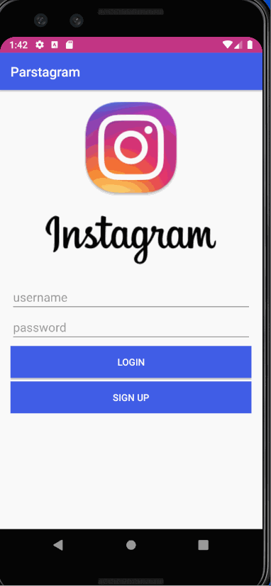
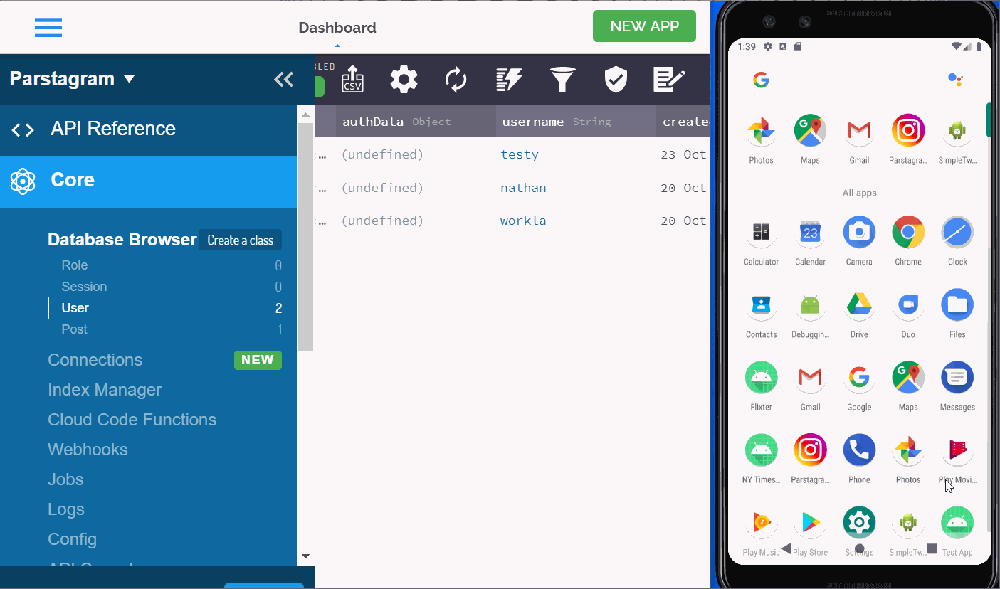
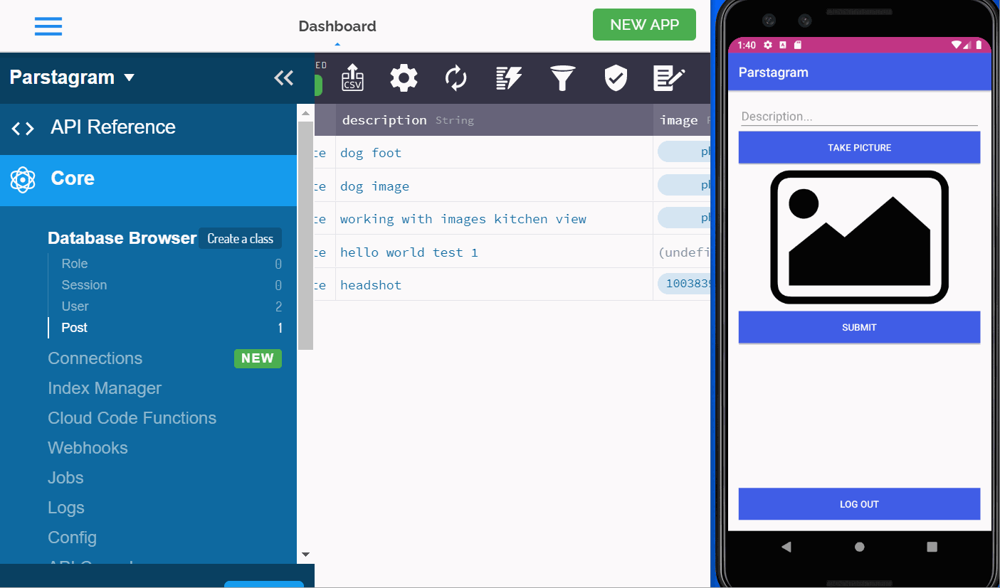

# Project 3 - *Parstagram*

**Parstagram** is a photo sharing app similar to Instagram but using Parse as its backend.

Time spent: 11 hours spent in total

## User Stories

The following **required** functionality is completed:

- [x] User can sign up to create a new account using Parse authentication.
- [x] User can log in and log out of his or her account.
- [x] The current signed in user is persisted across app restarts.
- [x] User can take a photo, add a caption, and post it to "Instagram".

The following **optional** features are implemented:

- [x] User sees app icon in home screen and styled bottom navigation view
- [x] Style the feed to look like the real Instagram feed.
- [ ] After the user submits a new post, show an indeterminate progress bar while the post is being uploaded to Parse.

The following **additional** features are implemented:

- [ ] List anything else that you can get done to improve the app functionality!

## Video Walkthrough

Here's a walkthrough of implemented user stories:

The first gif shows the basic functionality.  First a nonexistent user tries to log in and it doesn't work.  Then a known user logs in and it works.  Then a sample post is shown being created.  Then the app is shown not allowing a post missing either a description or picture.  Fianlly, the current user logs out, which takes them back to the login activity.

The second gif shows teh creation of a user.  The new user info is typed on the login screen and sign up is hit.  The parse window shows that the user did not exist before, but now exists within the parse users.  It also shows the instagram icon replacing the generic android icon.

The third gif shows the Parse side of a post creation.  Only five posts are in Parse prior to the gif.  Then the user creates a post, and the updated Parse post page shows a sixth post with thye cat description and image.

The final gif shows that user login persists between app restarts.  The user logs in and the app is then closed.  When reopened, the user is still logged in.

## Notes

Describe any challenges encountered while building the app.

This was one of the more straight forward assignments.  The hardest part was trying to set up sign in and realizing I had to make a new User and call sign up on that user, as opposed to calling ParseUser.signUpInBackground().  

## Open-source libraries used

- [Android Async HTTP](https://github.com/codepath/CPAsyncHttpClient) - Simple asynchronous HTTP requests with JSON parsing
- [Glide](https://github.com/bumptech/glide) - Image loading and caching library for Android

## License

    Copyright 2020 Lauren Work

    Licensed under the Apache License, Version 2.0 (the "License");
    you may not use this file except in compliance with the License.
    You may obtain a copy of the License at

        http://www.apache.org/licenses/LICENSE-2.0

    Unless required by applicable law or agreed to in writing, software
    distributed under the License is distributed on an "AS IS" BASIS,
    WITHOUT WARRANTIES OR CONDITIONS OF ANY KIND, either express or implied.
    See the License for the specific language governing permissions and
    limitations under the License.
